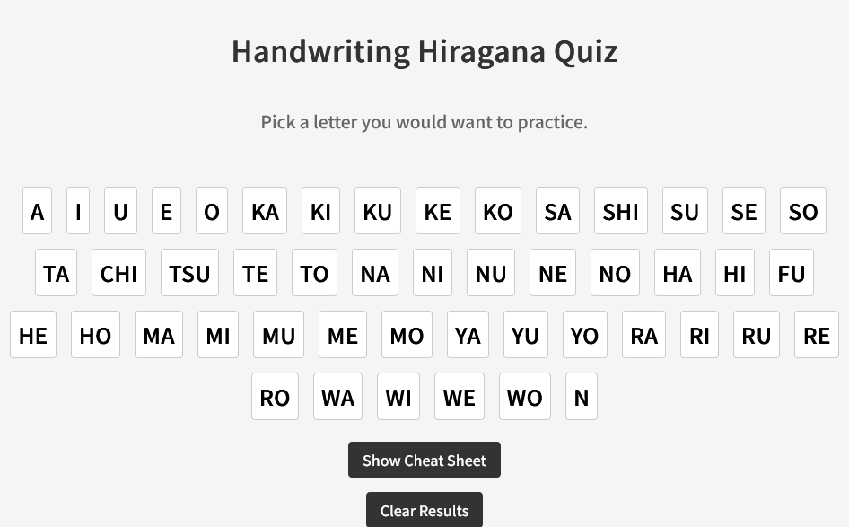
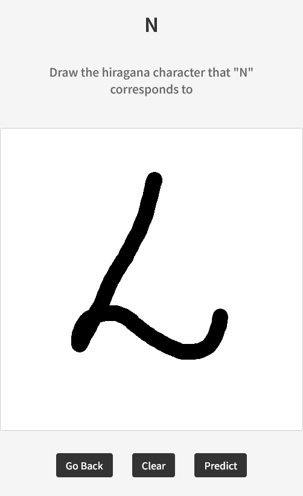
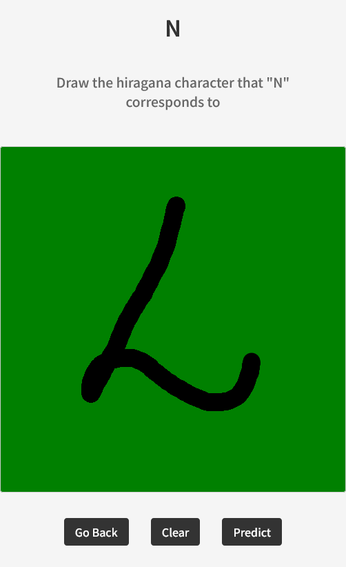
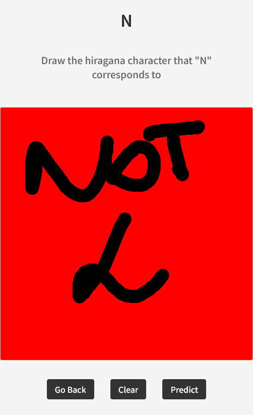
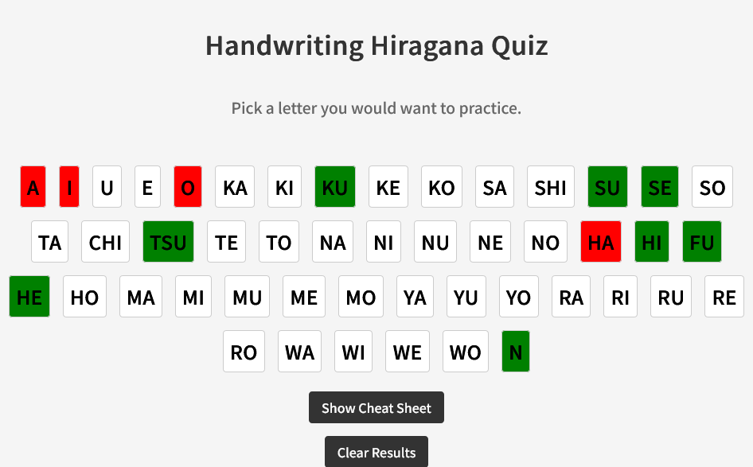

# Handwriting Hiragana Quiz

## Description

This web application consists of a type of quiz where the user can pick a hiragana character and write it on the screen. The application will then check if the character is correct or not.

## Data used

The data used for this project is a dataset of hiragana characters. This dataset can be found [here](https://github.com/rois-codh/kmnist). The dataset contains 48 different hiragana characters (with one extra character that is not used in production).

## Setup

To run this web application locally you will need to clone this project and install the dependencies using this command:

```bash
git clone https://github.com/Detopall/handwriting-hiragana.git
```

### Client

On the client side you will need to install the dependencies and run the application using these commands:

```bash

cd client
npm install
npm run dev
```

After these commands the application will be running on your localhost.

### Server

On the server side you will need to use the virtual environment provided and start the server using these commands:

```bash
cd server
pipenv install
pipenv shell
python app.py
```

Now the server will be running on your localhost.

## Usage

If you take a look at the provided images in this readme, you can see that the application is very simple. You can pick a hiragana character. This will redirect you to the exercise where you can write it on the screen.

The application will then check if the character is correct or not using a self trained neural network. You will immediately see if you were correct or not, because the background of the character will give it away.

After this you can head over to the main page again and pick another character. You will also see your progress by looking at the color of the exercises.

## Images






